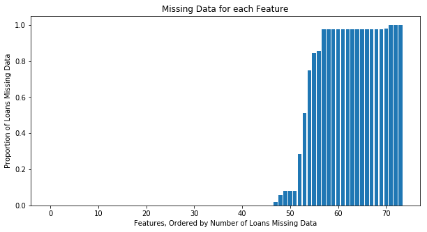
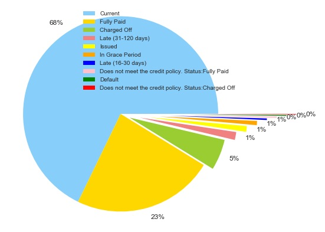
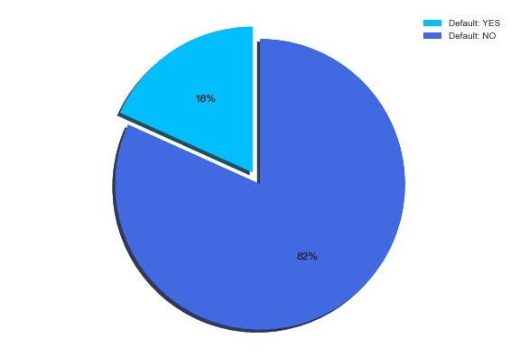
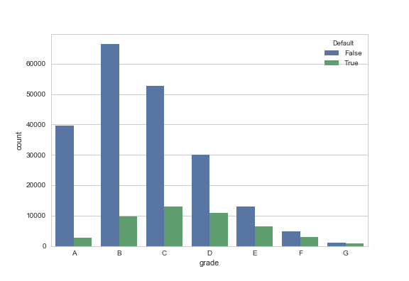

# Loan Default Prediction

Report to manager --

Here at Lendors "R" Us we have seen great success over the years, thanks to the autonomy and empowerment we provide to our loan agents. However, as recent events in our San Diego office have revealed, our new hires often don't have the intuition or experience to make optimal loan approval decisions. As we proposed in our last memo, **we are investigating and modeling what factors describing loans best predict loan defaults**.

In this report, we provide a status update on our work. This includes:
1. Exploring, cleaning, and transforming our dataset.
2. Preliminary investigations into our dataset.
3. Plans for future development.

## Exploring, Cleaning, and Transforming our Dataset

Our dataset consists of features for all loans issued by Lending Club for an eight year span. This dataset contains information on **890k loans** during this period. For each loan, there are **75 variables**, including most importantly the current status of the loan (e.g. default, fully payed, etc.).

### Missing Data

A major roadblock for using this dataset is that many of the values are missing. The majority (40) of our features have at least some values missing. In fact, for some features the entries for almost *all* of the loans are missing. In the following graph, for each of the 75 features, we plot the proportion of loans that are missing data.

From this graph we learn that, even though 40 features are missing data, only about 20 features seems to be missing data for a significant proportion of the loans. This is a promising result, as many features may still be usable, despite missing some data. This could be accomplished by keeping the features for which, say, 80% of the loans have data. The remaining 20% of the loans may simply receive the mean, median, or zero value -- standard imputation techniques for dealing with missing data.

### Dirty Labels

The next major hurdle for using this dataset is that the column we intend to use as a label -- `loan_status` -- is not a simple indicator variable for defaulted or not. Instead, the loan status can take on extraneous values (such as "In Grace Period") which do not necessarily indicate whether the loan will default. Below we graph the proportion of loans with each raw loan status.

From this chart it becomes immediately clear that approximately 0% of the loans have the label "Default" -- a huge concern for us! If we do not have any examples of defaulting loans, it would be massively difficult to predict which loans *would* default. Thankfully, once alerted to this issue, we learned that "Charged Off" is a stage strictly after "Default"; thus we can consolidate the two label values into a unified "Default" value.

Additionally, we note that the majority of loans in the dataset have a loan status of "Current" meaning that they are still in the process of being paid off. This label, allowing with the other "Current"-esque labels, do not tell us definitively whether a given loan results in a default. Thus in our preliminary analyses we drop the loans which have these intermediate statuses.

Altogether, our cleaned labels are "YES" (i.e. "Default" or "Charged Off") and "NO" (i.e. "Fully Paid). This cleaned dataset still has 250k example loans, which is sufficiently large to build our models with. Even better, we note that the class-imbalance of default-to-nondefault loans is just 18:82. This is promising because we have plenty of examples from each class of loans, and we can effectively train to predict loan defaults.

### Additional Analyses

In addition to the data exploration described above, we conducted other data analyses that have not yet led to actionable results. We discuss two examples below.

Most interestingy, we looked at the predictive power of "Loan Grade" on the default rate and graphed the ratio of default-to-nondefault for each grade. It was interesting to observe that even though the default rate increases as the grade worsens, the number of approved loans does not vary monotonically with the grade. We have not yet used this fact, but it may be helpful for future development as we account for class imbalance in the data.

On another important note, we manually investigated each of the 75 features to see if they are mis-typed by our dataframes package, Pandas in Python. To do this, we had to read the data definitions for every feature and determine by hand the appropriate type. Unfortunately quite a few string-typed columns contained other data, such as dates or ordinal types. As we did not use these columns, we have not yet cleaned or reparsed them. This remains for future development.

## Preliminary Investigations into our Dataset

As one preliminary investigation, we built a random forest model for our loan default prediction task. Our goal was to use this preliminary analysis as a proof-of-concept -- to show that it is feasible to tackle this default predicition problem. As such, we did not use complex feature transformations, involved feature selection, or finely tuned models. Our preliminary analysis shows promising results; we describe them below.

### Data Selection

The labels we use are the cleaned labels described [above](#labels). As such, we only use the 250k loans for which the loan is complete and either defaulted or not.

We use a small subset of the available features. These features were chosen because their definitions make sense to us, and we believe they may reasonably predict whether a loan will default. Again, we do not perform complex feature transformations such as using polynomial kernels, normalization, or feature whitening. The features are:
* `!!feature!!`
* `!!feature!!`
* `!!feature!!`
* `!!feature!!`
* `!!feature!!`

### Model

The model we use is a random forest regressor. The forest has !!number!! trees each with !!number!! layers trained on subsets of !!number!! features. The model was trained for !!number!! !!iterations/epochs!!, taking approximately !!number!! minutes. For training, the model only had access to the training dataset consisting of !!number!! loans. For testing, the model was evaluated on a disjoint test dataset consisting of !!number!! loans.

### Results

!!descriptions!!

!!graphs!!

!!confusion matrices!!

## Plans for Future Development

Thanks to our promising start, we believe we are well on track to modeling which factors describing loans best predict whether the loan will default. At a high level, as we continue to develop our project we will clean and transform features, tune our models using cross-validation, and aim to make our out-of-sample error estimates both low and tight. Logistically, we will run our experiments in the next two weeks and be ready to analyze our final results then.

### Feature Transformations

One primary line of work we repeatedly touched on above is to further clean, augment, and select our features. First, we plan to [impute values](#impute) for features with some missing values. Additionally, the features [misparsed as string-type](#strings) need to be converted in a principled manner. This entails defining ordinal types, creating dummy indicator variables, and perhaps performing fuzzy matching to reparse the feature values. Next, we will perform [feature transformations](#transform) such as using polynomial kernels. Finally, we will pare down this augmented set of features by selecting only the top few, as determined by a generalized linear model trained with an l1-regularized least squares objective. The l1-regularization will force the weights of the redundant features towards 0, leaving the most predictive features.

### Model Selection

We will continue to experiment with different models for this logistic regression problem. By using powerful models such as random forests, we will avoid underfitting. In addition to the random forest regressor above, we will try simple generalized linear models trained with l2-regularization. To compare these two models, and across different settings of hyperparameters, we will perform cross-validation to get a (biased) sense of their relative out-of-sample errors. Most crucially, *in order to avoid overfitting to the validation set* we will not use try many of these settings. We will pick the model with the best performance on the validation set.

### Testing

Throughout the model selection process described above, we will only use the training dataset. We will reserve the disjoint testing dataset for the very end, when we are ready to test or final model (or couple of models). Using the Hoeffding bound, we will be able to make a fairly tight estimate of the out-of-sample error of our final model(s). With these models we will evaluate feature importance, to finally conclude which factors best predict whether a loan will default.
